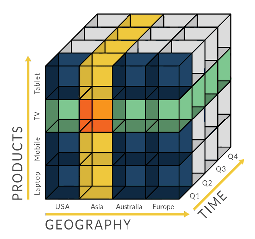

# **L’OLAP** 
L’OLAP, ou traitement analytique en ligne, est une technologie qui permet d’effectuer à grande vitesse des requêtes complexes ou des analyses multidimensionnelles sur de grands volumes de données dans un entrepôt de données, un [data lake](docs/dataLake) ou un autre référentiel de données. L’OLAP est utilisé dans la business intelligence (BI), l’aide à la décision et dans diverses applications de prévision et de production de rapports d’entreprise.  
La plupart des données d’entreprise ont plusieurs dimensions, c’est-à-dire plusieurs catégories dans lesquelles elles sont décomposées à des fins de _présentation_ ou de _suivi ou d’analyse_ :
* *les chiffres de vente peuvent avoir plusieurs dimensions liées au lieu :
    *  région ;
    *  le pays ;
    *  l’état/province ;
    *  le magasin.
* *à la période :
    * Année ;
    *  Mois ;
    *  Semaine ;
    *  Jour.
    *  au produit :
       *  vêtements (hommes/femmes/enfants),
       *  marque ; type ;
       *  et plus encore.

Nonobastant, dans un data warehouse ou un data lake, les ensembles de données sont stockés dans des tables, pouvant organiser les données selon seulement deux de ces dimensions à la fois. L’OLAP extrait les données de plusieurs ensembles de données relationnelles et les réorganise dans un format multidimensionnel qui permet un traitement très rapide et une analyse génératrice d’informations.  
## **Comment fonctionne l’OLAP ?**
La première étape du fonctionnement de l’OLAP est la collecte de données d’une ou plusieurs sources, cet ensemble est ensuite stocké dans des datawarehouses. Puis, OLAP rassemble et organise des bases de données sous forme de cubes OLAP afin de privilégier la vitesse des analyses. Un cube contient des données triées au sein de tables _dites dimensionnelles_ et _dont les dimensions sont ensuite renseignées par les utilisateurs_.

## **Qu’est-ce qu’un cube OLAP ?**
C’est l’élément central de la plupart des systèmes OLAP,une base de données multidimensionnelle organisée en tables permettant le traitement et l’analyse de plusieurs dimensions de données beaucoup plus rapidement et efficacement qu’une base de données relationnelle.
Une table de base de données relationnelle est structurée comme une feuille de calcul et stocke des enregistrements individuels dans un format bidimensionnel (ligne et colonne). Chaque « fait » de donnée de la base de données se trouve à l’intersection de deux dimensions (une ligne et une colonne), qui peuvent être par exemple la région et les ventes totales.  
Les outils de reporting SQL et de base de données relationnelle peuvent certes interroger, rapporter et analyser des données multidimensionnelles stockées dans des tables, mais les performances ralentissent à mesure que les volumes de données augmentent. Et il faut beaucoup de travail pour réorganiser les résultats de manière à se focaliser sur différentes dimensions.  
Le cube OLAP étend la table à des couches supplémentaires dont chacune ajoutant des dimensions supplémentaires, généralement le niveau suivant dans la « hiérarchie conceptuelle » de la dimension.  
* La couche supérieure du cube peut organiser les ventes par région ; 
* Les couches supplémentaires peuvent être le pays ;
* L’État/la province ;
*  La ville et même un magasin spécifique.  

Théoriquement, un cube peut contenir un nombre infini de couches. Un cube OLAP représentant plus de trois dimensions est parfois appelé un hypercube. Des plus petits cubes peuvent également exister au sein des couches : 
* Chaque couche de magasin peut contenir des cubes organisant les ventes par vendeur et par produit. 

En pratique, les analystes de données créeront des cubes OLAP contenant uniquement les couches dont ils ont besoin, pour une analyse et des performances optimales.  

___
>>> Sources  
[IBM]( https://www.ibm.com/fr-fr/topics/olap#:~:text=IBM-,Qu'est%2Dce%20que%20l'OLAP%20%3F,un%20autre%20r%C3%A9f%C3%A9rentiel%20de%20donn%C3%A9es./)  
[DataScientest]( https://datascientest.com/olap-tout-savoir-sur-cette-puissante-organisation-des-bases-de-donnees)  
